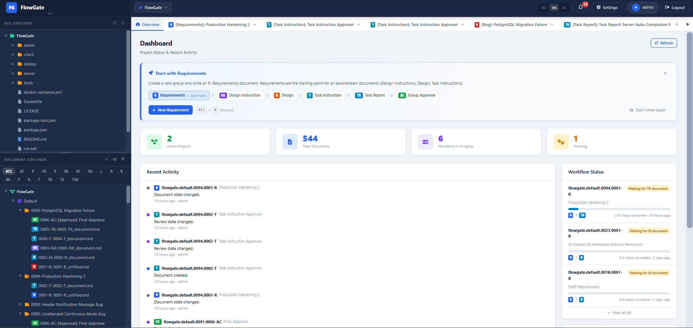
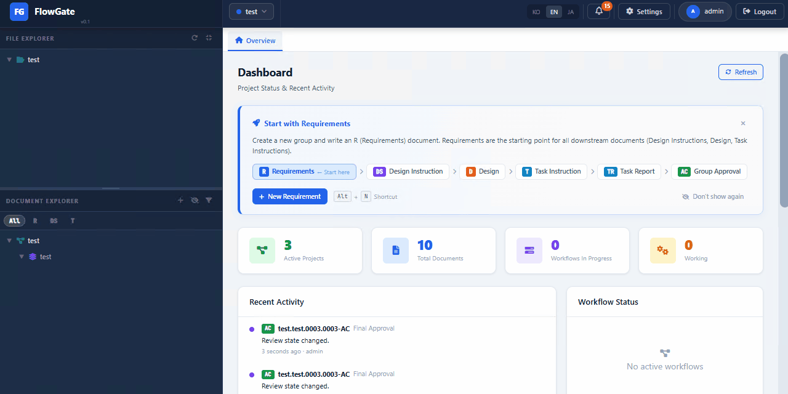
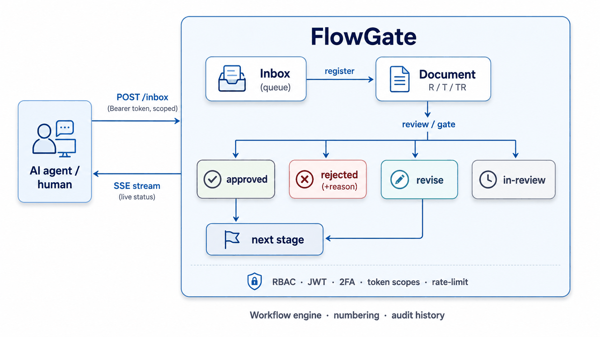

<div align="center">

# FlowGate

### Ditch your editor right now.
**Your agent can write the code. FlowGate makes it prove the work.**

</div>

> **You handed the task to an autonomous agent, said *"it'll figure it out,"* and walked away.**
> It says it's done. Is it?

### FlowGate is the gate between *"the agent says it's done"* and *"it's actually done."*

A typed document pipeline where completion isn't a claim — it's evidence.
*Requirement → Task → Task Report → Approval — every handoff passes a gate a human (or another agent) signs off on.*

<div align="center">

***The agent didn't lie. It just never had to be right.***



*Register a requirement → start a continuous run → inspect the evidence → approve.*



</div>

---

## Try it (Docker)

```bash
git clone https://github.com/horrible-gh/FlowGate.git
cd FlowGate
docker compose up -d --build
docker compose exec flowgate python create_dev_user.py \
  --username admin --email admin@flowgate.local --password 'ChangeMe!' --admin
# → open http://localhost:8089/flowgate  and log in as admin
```

> That's the fastest taste. The full Quick start — local dev with auto-reload, plus MySQL/PostgreSQL — is [further down](#quick-start-local-sqlite).

---

## Why this exists

Hand a coding task to an autonomous AI agent and you eventually hit the same wall: **it tells you it's done when it isn't.** The tests "pass," the bug is "fixed," the feature is "fully implemented" — and none of it is true. The agent isn't lying maliciously; it just has no structural reason to be accountable. There's no gate between *"I claim I did X"* and *"X is accepted."*

FlowGate is that gate.

It turns work into a **typed document pipeline**. An agent can't just *say* a task is finished — it has to register an artifact (a Task, a Task Report, a Requirement) through an authenticated API. That artifact enters an **inbox**, gets a **review status**, and can be **approved, rejected with a reason, or sent back for revision**. Nothing moves to the next stage until the current one clears its gate. The agent's claim and the verified state are no longer the same thing — which is the entire point.

The system has been **dogfooding itself for its own development**: the requirement and work order that produced *this very README* were filed, reviewed, and approved through FlowGate.

---

## How it works

Each unit of work is a **document** with a type and a place in a sequence. Documents are grouped, numbered automatically, and chained: a Requirement (`R`) triggers a Task (`T`), which produces a Task Report (`TR`), and so on. Every transition is a reviewable gate.



- **Typed documents & auto-numbering** — `R` (requirement), `T` (task), `TR` (task report), conversation docs, and more, each numbered and chained within a group.
- **Review gates** — approve / reject-with-reason / request-revision, with full rejection history kept on the document.
- **Remote worker API** — agents authenticate with **scoped Bearer tokens** and submit work over HTTP. A **dry-run** mode validates a submission (URL, token, fields, permissions) without consuming the token.
- **Structured clarification (Q)** — when an agent is unsure, it doesn't guess and it doesn't pop a dialog into the void: it **registers a question bound to the document**, which the system routes for a definite answer.
- **Live updates** — Server-Sent Events push status changes to every watcher in real time, with a notification feed and unread badge.
- **Mentions & handoffs** — generated, copy-ready mention blocks carry the exact context (references, predecessors) the next worker needs.
- **Continuous (unmanned) work** — a scoped continuation token lets an agent run a self-chaining sequence: the server auto-advances through the workflow toward a target stage, optionally pausing for human Q&A in review mode, so a long task can run unattended without dropping its gates.
- **Conversation documents** — a dedicated chat-style document type (`CH`) for back-and-forth that doesn't fit the requirement → task → report spine.

---

## Tech & engineering

| Area | What's in the box |
|------|-------------------|
| **Backend** | Python · FastAPI · v1 route modules for documents, workflow, RBAC, tokens, remote tools, SSE, dashboard, inbox, Q&A, and more |
| **Database** | SQLite / MySQL / PostgreSQL — **86 ordered migrations per backend** (258 SQL files total; one matching set in each of `sqlite`, `mysql`, and `postgres`) plus a runtime dialect-translation layer (`db/dialect.py`), clean module split (`api` / `auth` / `db` / `rbac` / `workflow` / `numbering`) |
| **Auth & security** | JWT + bcrypt + **TOTP 2FA** (with backup codes) + refresh/blacklist · per-token action scopes · `slowapi` rate limiting |
| **Frontend** | Vue 3 · Pinia · vue-i18n (ko / ja / en) · vue-router · Vite |
| **Testing** | Focused backend and frontend regression tests around workflow, auth, documents, SSE, dashboard, Q&A, and review flows |
| **Ops** | **Docker / docker-compose** (one-command, SQLite or bundled Postgres/MySQL) · `systemd` unit (`deploy/flowgate.service`) · one-shot `setup.sh` (Linux) / `setup.ps1` (Windows) · selectable DB backend · Redis-ready |

### Security posture and trust boundary

AI CLI integrations (such as Claude and Codex) and configured test runners are deliberately arbitrary-command execution surfaces: executing repository commands is the feature, not a capability FlowGate can safely remove. Treat anyone who can configure or launch them as having command-execution authority inside the FlowGate service account and its filesystem/container boundary, and isolate that boundary and grant it only the credentials and paths it needs. Newly registered providers keep **Skip permission confirmation** off by default; an operator must explicitly enable the warning-marked option. Leaving it off can pause unmanned work at an approval prompt, while enabling it allows the CLI to act without per-command confirmation.

`FLOWGATE_AGENT_API_BASE` is the canonical origin reachable by spawned CLI workers, not the browser-facing/operator URL. Set it to an HTTP(S) origin only; for a same-host default deployment the recommended value is `http://127.0.0.1:8089`. If it is absent, FlowGate keeps an explicit operator port or otherwise uses the trusted `FLOWGATE_PORT` fallback. Blank or malformed configured values stop CLI startup instead of silently sending a work token to a different origin.

---

## Quick start (local, SQLite)

> Requires Python 3 and Node.js.

```bash
# 1. Backend
cd server
cp .env.sample .env          # set SECRET_KEY, DB_TYPE=sqlite, CONTEXT=/flowgate
pip install -r requirements.txt
python dev.py                 # serves on http://0.0.0.0:8088  (auto-reload)

# 2. Frontend (separate terminal)
cd client
npm install
npm run dev                   # Vite dev server with HMR
```

Create the first user with `server/create_dev_user.py`, then open the client and log in.

For a one-command staging deploy on **Linux** (venv + `.env` + client build + `systemd` install + admin account), run `./setup.sh` from the repo root. On **Windows**, run `.\setup.ps1` (venv + `.env` + client build + generated `run.bat` launcher + admin account). Both default to SQLite; target MySQL/MariaDB or PostgreSQL by presetting `DB_TYPE` (e.g. `DB_TYPE=postgres DB_HOST=… ./setup.sh`, or `.\setup.ps1 -DbType postgres -DbHost …`).

## Quick start (Docker)

> Requires Docker with the Compose plugin. Builds the client and server into one image; persistent state (SQLite DB, document storage, generated secrets) lives in the `flowgate-data` volume.

```bash
# SQLite (default) — one container, state on a named volume
docker compose up -d --build
# → http://localhost:8089/flowgate

# Seed the first admin (idempotent; re-runs skip if it already exists)
docker compose exec flowgate python create_dev_user.py \
  --username admin --email admin@flowgate.local --password 'ChangeMe!' --admin
```

`SECRET_KEY` and the token pepper are generated **once** on first start and persisted to the data volume (never rotated on restart, so issued tokens keep working). To run against a bundled database instead, start with a profile and set `DB_TYPE` — the app waits for the DB and auto-migrates the schema on boot:

```bash
DB_TYPE=postgres docker compose --profile postgres up -d --build   # + Postgres 16
DB_TYPE=mysql    docker compose --profile mysql    up -d --build   # + MariaDB 11
```

### Required security settings and secret backups

`ALLOWED_ORIGIN` now defaults to an empty value, which blocks all cross-origin browser requests while leaving the bundled same-origin client unaffected. Set it explicitly to the permitted origin or origins before a separately hosted frontend or another external web origin calls the API.

Stored AI provider API keys are encrypted with `FLOWGATE_AI_ENCRYPT_KEY`; `FLOWGATE_AI_ENCRYPT_KEY_PREV` is available temporarily when rotating that key. Docker, `setup.sh`, and `setup.ps1` generate the active key automatically, so a normal installation does not require an operator to invent one.

Back up the secret material together with the database and storage volume. For Docker, include `$FLOWGATE_STORAGE_DIR/.flowgate-secrets.env` from the `flowgate-data` volume. For local or setup-script installations, include `server/.env` entries for `SECRET_KEY`, the `FLOWGATE_TOKEN_PEPPER_*` values, `FLOWGATE_GIT_ENCRYPT_KEY`, `FLOWGATE_TOTP_ENCRYPT_KEY`, and `FLOWGATE_AI_ENCRYPT_KEY` (plus any `_PREV` key present during rotation). Losing or replacing these values can make stored Git credentials, AI provider API keys, and enrolled TOTP secrets unreadable; a database-only backup is therefore incomplete.

### Talking to it as an agent

```bash
# Submit an artifact (use dry_run:true first to validate without consuming the token)
curl -X POST http://<host>:8089/flowgate/api/v1/inbox \
  -H "Authorization: Bearer <scoped-token>" \
  -H "Content-Type: application/json" \
  -d '{ "action":"new", "project":"flowgate", "module":"default",
        "group_name":"flowgate.default.0072", "doc_type":"TR",
        "prev_doc_id":"flowgate.default.0072.0002-T",
        "title":"...", "content":"..." }'
```

The API exposes typed help endpoints (`GET /flowgate/api/v1/help/doc_type`) so an agent can discover document types and required fields at runtime.

---

## Project layout

```
FlowGate/
├── server/                    # FastAPI backend
│   ├── routers/               # app wiring (main.py mounts every sub-router)
│   ├── modules/flow_gate/     # the real domain
│   │   ├── api/               # inbox, tokens, v1 routes (documents, workflow, SSE, dashboard, q&a, remote…)
│   │   ├── auth/  rbac/        # JWT + 2FA, role-based access
│   │   ├── workflow/  numbering/
│   │   ├── documents/  conversation.py  process_service.py
│   │   └── db/                # multi-backend data access
│   ├── sql/migrations/        # 86 ordered migrations in each of {sqlite, mysql, postgres}
│   └── tests/                 # backend regression tests
├── client/                    # Vue 3 + Pinia + Vite SPA
├── Dockerfile                 # multi-stage: build client → Python runtime
├── docker-compose.yml         # one-command stack (SQLite / Postgres / MySQL profiles)
├── deploy/
│   ├── flowgate.service       # systemd unit template (rendered by setup.sh)
│   └── docker-entrypoint.sh   # container init: secrets, DB wait, admin seed
├── setup.sh                   # one-shot staging deploy (Linux)
├── setup.ps1                  # one-shot staging deploy (Windows)
└── TESTING.md                 # how to run the suites (Fast/Standard/Full) and when to add a test
```

---

## Status

FlowGate is **built as a working system**, not a throwaway prototype — it runs the document pipeline that drives its own development. The backend, auth, workflow engine, multi-database support, and remote API are the solid, well-tested core; the frontend's conversation and review-UI polish is the area under active iteration.

Current highlights: full **multi-database** migration sets (MySQL / PostgreSQL alongside SQLite) plus a runtime dialect-translation layer · **continuous (unmanned) work** chains · Git-backed group branches, worktrees, diffs, and finalize actions · configurable Claude, Copilot, Codex, custom CLI, and API-based AI invocation · a notification feed · and conversation documents.

**Roadmap:**

- **Deeper Git automation** — build on the existing repository, branch/worktree, diff, merge, and finalize support with pull-request hosting integrations and configurable transition policies.
- **Richer agent integrations** — expand the current CLI/API invocation flow with more provider-aware commands and tighter submit, advance, clarify, and review ergonomics.
- **GUI transition** — evolve the current browser SPA toward a full graphical client for authoring, reviewing, and conversing across pipelines — a desktop-grade workspace rather than a set of web pages.

---

## License

Released under the [MIT License](LICENSE) — © 2026 horrible-gh.
